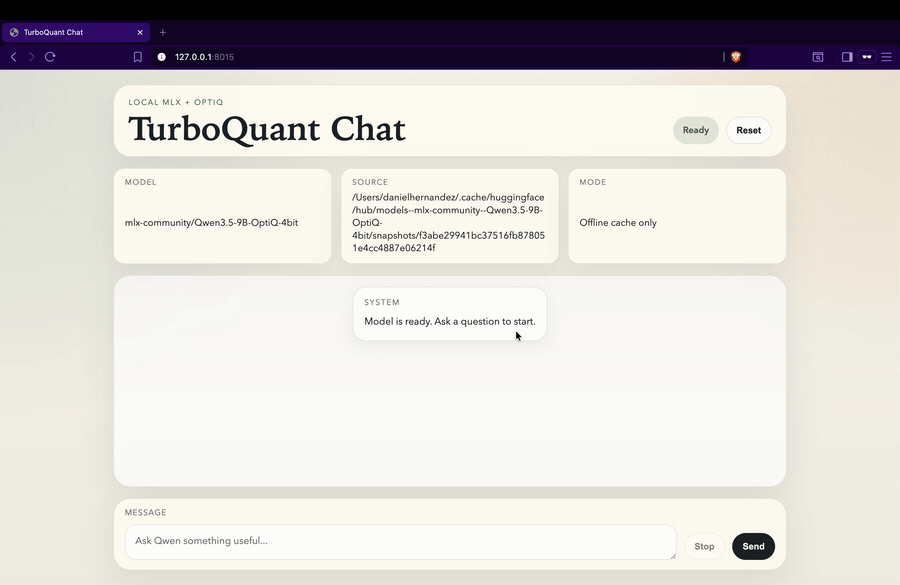

# TurboQuant Chat

Local browser chat UI for `mlx-community/Qwen3.5-9B-OptiQ-4bit` on Apple Silicon, using:

- `mlx-lm` for local inference
- `mlx-optiq` for OptiQ quantization support
- TurboQuant KV cache for the self-attention layers
- a lightweight Python server plus browser UI



## Why This Exists

This project packages a real local `Qwen3.5 9B` experience into something you can actually use:

- local inference on a 16 GB Apple Silicon machine
- offline-first loading once the model is cached
- streamed responses in both terminal and browser
- a practical chat UI with stop/reset controls
- TurboQuant KV cache compression on the compatible attention layers

It is not a hosted API wrapper, and it is not a fake frontend. The runtime is local MLX.

## Quick Start

```bash
cd ~/tq-qwen
python3.12 -m venv .venv
source .venv/bin/activate
pip install -r requirements.txt
python serve_qwen_ui.py --offline
```

Then open:

```text
http://127.0.0.1:8015
```

## Features

- Real local `Qwen3.5-9B-OptiQ-4bit` runtime
- Browser UI with streamed answers
- Live `Thinking...` state with token count and `tok/s`
- Terminal chat mode for quick local use
- Offline cache mode after the first model download
- Qwen-native non-thinking mode in the chat template

## Browser UI

Start the local server:

```bash
cd ~/tq-qwen
source .venv/bin/activate
python serve_qwen_ui.py --offline
```

UI behavior:

- shows a live `Thinking...` state while the model generates
- renders the final answer in a formatted assistant bubble
- supports `Stop` to interrupt a live generation
- supports `Reset` to clear server-side conversation history
- runs a single active generation at a time

## CLI Usage

Single prompt:

```bash
cd ~/tq-qwen
source .venv/bin/activate
python run_qwen_turboquant.py --offline "Explain how recurrent and self-attention layers differ."
```

Interactive terminal chat:

```bash
cd ~/tq-qwen
source .venv/bin/activate
python run_qwen_turboquant.py --offline --chat
```

Streaming is enabled by default. To wait for the full answer before printing:

```bash
python run_qwen_turboquant.py --offline --chat --no-stream
```

Chat commands:

- `/clear` resets the conversation history
- `/exit` or `/quit` leaves chat mode

## Notes

- The model weights come from Hugging Face the first time you run the script.
- After the first download, `--offline` loads from the local Hugging Face cache only.
- TurboQuant is applied only to layers exposing `self_attn`; the recurrent path remains untouched.
- Use `--bits 3` or `--bits 4` to change KV cache compression.
- Use `--verbose` to print which cache slots were replaced.
- Use `--raw-prompt` to bypass the tokenizer chat template.
- The browser UI and CLI share the same runtime module.

## Repo Layout

- `serve_qwen_ui.py`: local browser server
- `run_qwen_turboquant.py`: terminal entrypoint
- `tq_qwen_runtime.py`: shared MLX + TurboQuant runtime
- `static/`: browser UI assets

## Smoke Test

```bash
cd ~/tq-qwen
source .venv/bin/activate
python run_qwen_turboquant.py --max-tokens 16 --temp 0.0 --raw-prompt \
  "Answer with exactly: TurboQuant KV cache is active."
```
